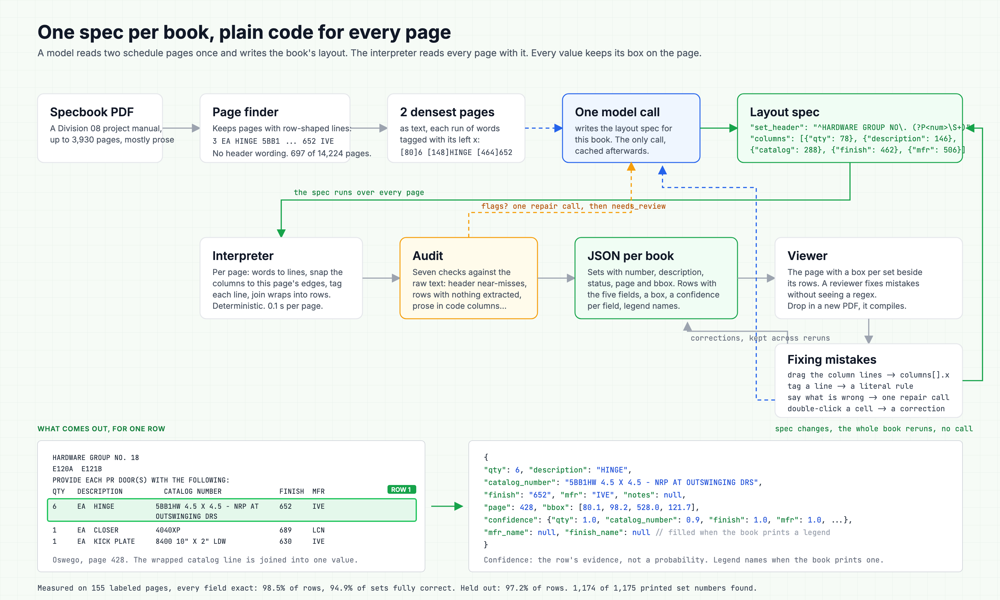

# fresco-hardware-sets

Extracts door hardware sets from Division 08 spec PDFs for the Fresco take-home. `hwsets/` is the extractor, `experiments/` is the research that led to it, `docs/` explains both.

## The idea

Each specbook uses one layout for all of its sets. Instead of sending every page to a model, a model reads 2 schedule pages once and writes a short layout spec for the book. Plain code then reads every page with that spec.

Oswego's spec, shortened:

```json
{
  "set_header": "^HARDWARE GROUP NO\\. (?P<num>\\S+)",
  "row_start": "^\\d{1,3}$",
  "columns": [
    {"field": "qty", "x": 78}, {"field": "unit", "x": 110}, {"field": "description", "x": 146},
    {"field": "catalog", "x": 288}, {"field": "finish", "x": 462}, {"field": "mfr", "x": 506}
  ]
}
```

The column at x=506 is the manufacturer column, so every `PE` or `ZER` in it is a manufacturer for the whole book. Every value comes from real words on the page, so each set gets an exact page and bounding box.



Diagram source: [docs/diagrams/architecture.html](docs/diagrams/architecture.html), a hand-laid SVG, rendered by `docs/diagrams/render.sh`.

## Where it stands

On 155 labeled pages from 20 books (labeled from page images, see [BENCHMARK.md](docs/BENCHMARK.md)), 98.5% of the 2,218 labeled rows come out exactly right with every field correct, and 94.9% of the 311 sets are fully correct. On a separate held-out set of 25 pages scored once after all tuning, it is 97.2% of rows and 89.5% of sets. Across all 20 books, 1,174 of the 1,175 set numbers printed in the PDFs are in the output. Every spec in `specs/` was written by the API in one call per book (plus one repair call where the audit flagged something). The only edits since came through the viewer's own feedback tools, two rules on Star.

| Doc | What it covers |
| :--- | :--- |
| [PLAN.md](docs/PLAN.md) | The approach and build order |
| [IMPLEMENTATION_BACKEND.md](docs/IMPLEMENTATION_BACKEND.md) | Extraction: goals, function trace, data structures |
| [IMPLEMENTATION_FRONTEND.md](docs/IMPLEMENTATION_FRONTEND.md) | Viewer: screens, API, state, build order |
| [CAVEATS.md](docs/CAVEATS.md) | The tricky cases from the brief, with real examples |
| [BENCHMARK.md](docs/BENCHMARK.md) | How the benchmark works |
| [RESULTS.md](docs/RESULTS.md) | Benchmark results |
| [APPROACHES.md](docs/APPROACHES.md) | The four approaches compared, and what was ruled out |
| [APPROACH_RESULTS.md](docs/APPROACH_RESULTS.md) | How each approach scored on the benchmark |

## Running it

Needs [uv](https://docs.astral.sh/uv/). From the repo root:

```bash
uv sync
```

```bash
uv run hwsets extract "data/village-of-oswego/SPECIFICATIONS VOLUME 1.pdf" -o out/oswego.json
```

The 20 sample books have their compiled specs checked in under `specs/`, so they run with no API key and give the output in the docs. A new book needs `ANTHROPIC_API_KEY` in the environment or in `.env`: one call writes its spec into `specs/`, and a second call runs only if the audit flags something. `--spec path.json` uses a spec of your own, `--no-llm` fails instead of calling the API.

Output: one JSON per book with every set's number, description, status, 1-based page and bounding box, and its components with `qty`, `description`, `catalog_number`, `mfr`, `finish`, `notes` (text printed for that row, a block of notes after the last row goes to the set's `notes` instead), each with its own page and box. The exact shape is in [IMPLEMENTATION_BACKEND.md](docs/IMPLEMENTATION_BACKEND.md).

## The viewer

```bash
uv run hwsets serve
```

Then open http://localhost:8000.

- **Library.** Every PDF under `data/` with its status and set count, searchable. Drop a new spec PDF on it and it is extracted on the spot (needs the API key for the one spec call).
- **Book view.** The page image with a box per set beside the set's components. Click a row to see it on the page. A CONF column scores each row, and a cell under 0.8 is tinted. Codes the book explains in a printed legend show their full name.
- **Fixing mistakes, no regex.** Double-click a cell to correct one value. Drag the column lines on the page to move a column for the whole book. Click a line and say what it is (a set header, not a component, a note). Or type what is wrong ("the set on this page is missing") and one model call edits the layout and reruns.
- **Export JSON** gives the result file.

## Running the benchmark

The specbook PDFs are not in this repo. Put the challenge's Drive folder ids in `scripts/drive_ids.txt`, one `folder_id:project-name` per line, then download:

```bash
scripts/download_data.sh
```

Run every sample book through the extractor with the checked-in specs, then score from `experiments/`:

```bash
uv run python experiments/run_hwsets.py
```

```bash
cd experiments && uvx --from pdfplumber python3 bench_tags.py
```

```bash
cd experiments && uvx --from pdfplumber python3 bench.py out_hwsets
```

```bash
cd experiments && uvx --from pdfplumber python3 bench_checks.py out_hwsets
```

## What is and is not in the repo

Included: all code, the compiled specs in `specs/`, and the benchmark labels, tags and checks in `experiments/eval/`. The Drive share holds 43 PDFs across 21 projects; 20 contain hardware sets and the other 23 (doors, frames, glazing sections, extra volumes) are the empty-book check.

Left out: the PDFs, rendered page images, page text dumps, and full extraction output, since they copy the challenge material wholesale.
